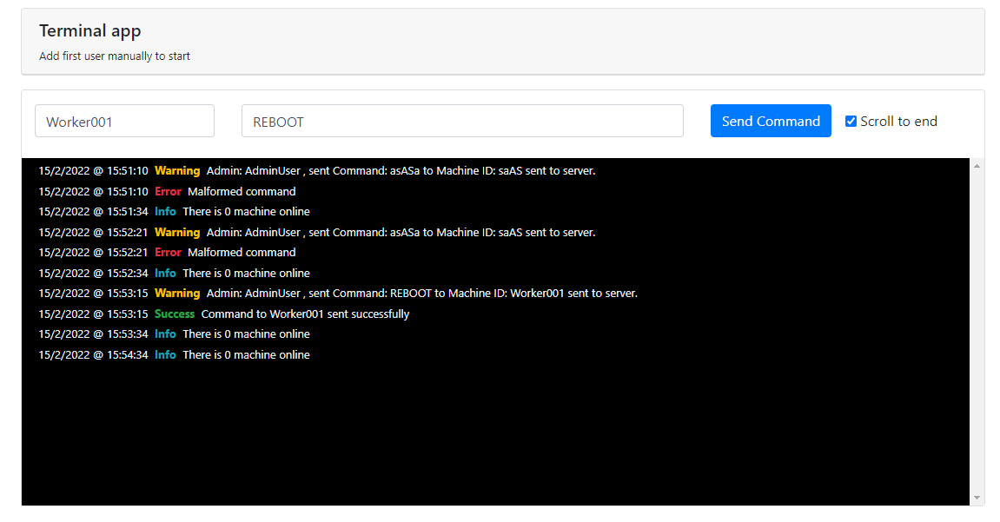
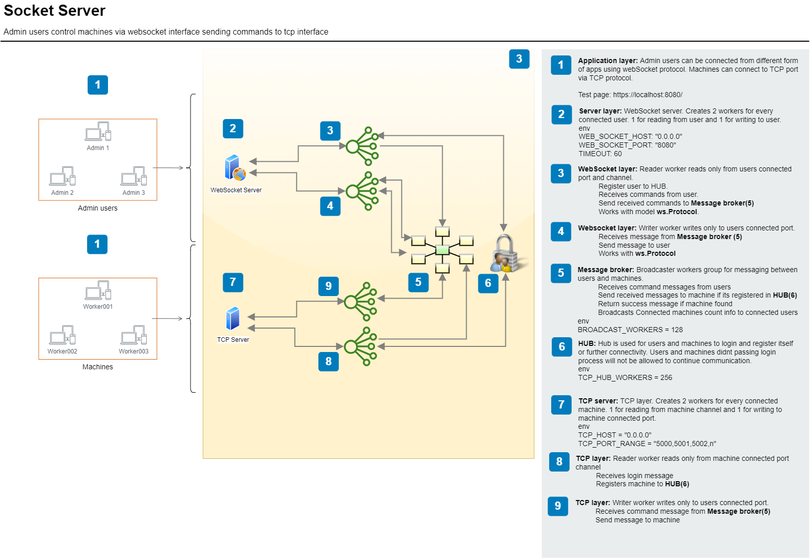
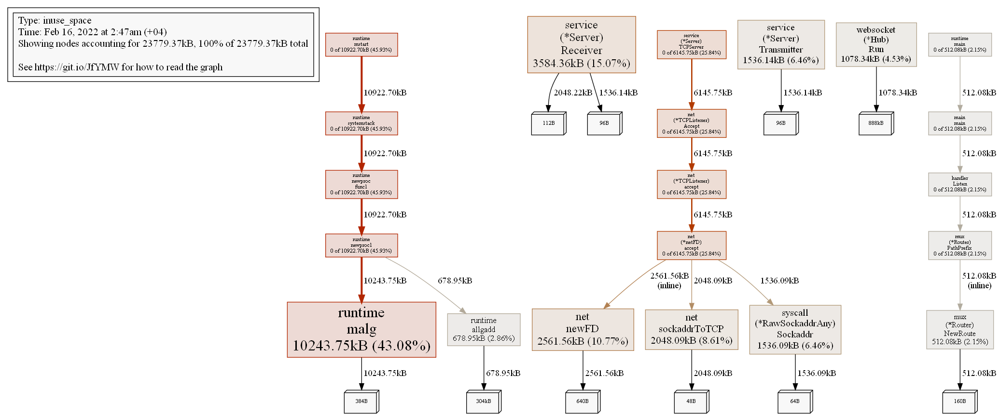

# SocketServer

Socket server for Machines and Users

## Description

This is socket server project where admin users can control machine clients. Admin users join server via WebSocket while
machine clients use TCP protocol Implemented HUB and Message broker allow users send commands to machines

## Installation

to start project in Linux system. Golang 1.65+ must be installed . After installation command below will start app.

```
mkdir project_folder
cd project_folder
git clone https://gitlab.com/sadiqov.cavid/socketserver.git
git branch -M main
 
go build -o main ./cmd/main.go
./main 
 
```

## Websocket server

Websocket will start in default http://localhost:8080 address To change host and port .env file must be changed

## Test and Deploy

For testing go to url http://localhost:8080/. Connect to WebSocket and send command to connected workers.



***

# README

Read file used as manual for this app. We can add any question and save here.

## App structure

For better understanding of inapp functionality check https://draw.io files in docs folder



## Usage

For profiling memory usage use command below then add png and confirm. It will generate heap profile. This should be
done periodically for improving and finding memory leaks.

Url for online reporting.
http://localhost:8080/debug/pprof/

```
go tool pprof http://localhost:8080/debug/pprof/heap
png or svg 

```



## Recommended

    - Add Authorization to websocket connection
    - Add Ping/Pong protocol to App and machile clients.

## Project status

Project in testing stage
